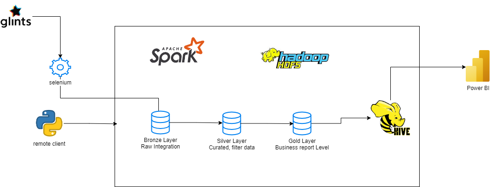
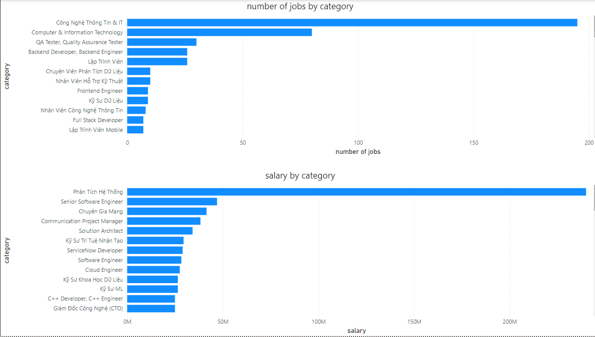
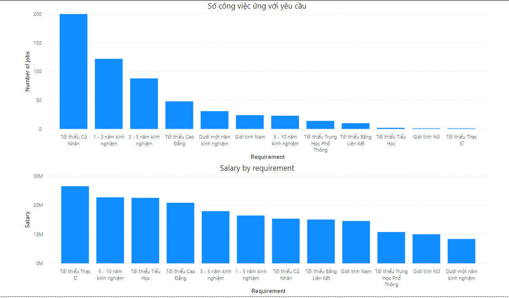
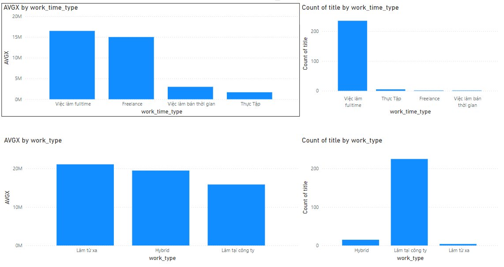

# Remote Client-Based Recruitment ETL Pipeline with Hadoop, Hive, PySpark, and Selenium

This project offers an ETL solution to efficiently extract, transform, and load recruitment data from Glints into a medallion architecture using Apache Hadoop and Apache Hive. It leverages a combination of tools including Hadoop, Hive, Spark, Selenium, and Power BI.

## Table of Contents
- [Overview](#overview)
- [Architecture](#architecture)
- [Prerequisites](#prerequisites)
- [System Setup](#system-setup)
- [Results](#results)

## Overview
This ETL pipeline performs the following steps:
1. Scrapes recruitment data from Glints using Selenium.
2. Stores the raw data in Hadoop HDFS via the [HDFS Driver](./src/hdfsDriver/Driver.py).
3. Transforms data using Pandas and stores it in the "silver" layer in HDFS, preparing it for analysis.
4. Aggregates data according to specific user requirements and loads it into Apache Hive using PySpark in remote mode.
5. Visualizes data in Apache Hive using Power BI.

## Architecture

## Prerequisites
1. VMware and Linux ISO image
2. Hadoop, Hive, Spark installed on a remote machine
3. Spark setup on the client
4. Python version 3.9 or higher

Alternatively, set up the environment using Docker [here](https://github.com/myamafuj/hadoop-hive-spark-docker.git).

## System Setup
> **Note**: This is a minimum setup; for stronger machines, higher specs are recommended.

### Hadoop Main Node
- OS: `ubuntu-24.04-desktop-amd64.iso`
- Memory: 4 GB
- Processor: 4 cores
- Storage: 100 GB

### Worker Nodes (1 and 2)
- OS: `ubuntu-24.04-live-server-amd64.iso`
- Memory: 4 GB
- Processor: 2 cores
- Storage: 40 GB

## Results
### Job and Salary Analysis by Category

### Job and Salary Analysis by Requirement

### Insights on Work Type Preferences

